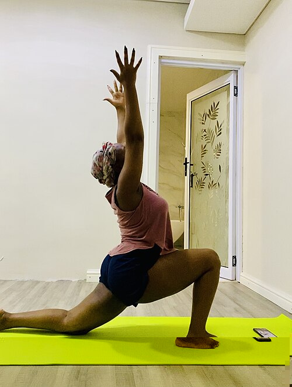
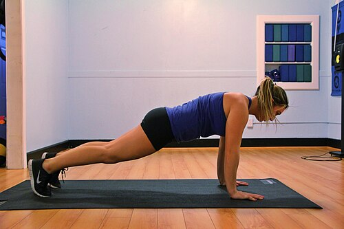

# 🏃 تفاصيل التمرين لحاتم — النسخة المفصّلة

> **السياق:** وزن 109 كجم · طول 187 سم · BMI 31.2 · ضغط متضبط · سكري متضبط ·
> **ورم دماغي حميد** (القيد الأهم). الهدف: نزول وزن تدريجي + حفظ اللياقة + أمان للورم.
> ⚠️ ممنوع تشخيص — دي خطة توجيهية من Mayo Clinic مخصّصة بقيودك.

## ⛔ القيود الصارمة (بسبب الورم الدماغي الحميد)
1. **🚫 لا رفع أثقال فوق 20 كجم** (ضغط داخل الجمجمة).
2. **🚫 لا حبس نفس (Valsalva)** أثناء أي مجهود — تنفّس طبيعي دايماً.
3. **🚫 لا تمارين صدمة عالية** ( jumping عميق / رفع عنق).
4. **⚠️ راقب:** صداع مفاجئ، دوخة، تشوّر بصري، اختلال توازن → توقف فوراً.
5. ✅ مسموح: مشي، سباحة، دراجة ثابتة، يوغا/Tai Chi، مقاومة خفيفة (band/وزن جسم).

## 📅 التقويم الأسبوعي المفصّل

### السبت — مشي سريع + توازن (40 د)
- **إحماء:** 5 د مشي بطيء + تحريك مفاصل
- **أساسي:** 25 د مشي سريع (نبض 100–120 / حديث مريح)
- **توازن:** 10 د — وقوف على رجل واحدة (30 ث × كل رجل)، خطوات جانبية
- **تهدئة:** 5 د مشي بطيء + تنفّس

### الأحد — دراجة ثابتة / سباحة (35 د)
- **دراجة:** مقاومة خفيفة-متوسطة، نبض 110–125، بدون انحناء عنق للأمام بشدة
- **أو سباحة:** 20×50م بهدوء (صديقة جداً للورم — صفر صدمة)

### الإثنين — مشي + مقاومة خفيفة (band) (40 د)
- **مشي:** 20 د
- **مقاومة band (كل تمرين 3×12):**
  - 🦵 ضغط رجل خلفية (leg curl بـ band)
  - 💪 صدر بالـ band (أمام الصدر) — راجعي صورة البلانك لتقوية الجذع كبديل
  - 🔙 ظهر منتصب (rowing بالـ band — **الظهر مستقيم**، لا انحناء)
  - 🦵 قرفصاء خفيفة (squat لنص عمق، وزن الجسم فقط) — صورة ↓
- **تهدئة:** 5 د

> 🖼️ **صور الحركات** (من Wikimedia Commons — CC/public domain):
> - القرفصاء الخفيفة (Squat): `صور-تمرين/squat.gif`
> - الاندفاع (Lunge): `صور-تمرين/lunge.jpg`
> - البلانك (تقوية الجذع): `صور-تمرين/plank.jpg`
> - الوقوف على رجل واحدة (توازن): `صور-تمرين/balance.png`

### الثلاثاء — راحة نشطة (15 د)
- مشي خفيف منزلي أو تمارين إطالة (stretching) — لا إجهاد

### الأربعاء — سباحة / مشي (35 د)
- سباحة 25 د أو مشي 35 د بنفس نبض السبت

### الخميس — مشي + مقاومة خفيفة (band) (40 د)
- نفس الإثنين (تكرار المقاومة مرتين أسبوعياً بيوم راحة بينهم ✅)

### الجمعة — مشي طويل / طبيعة (45 د)
- مشي في حديقة/طبيعة — نبض 100–115، استمتاع مش تنافس

**المجموع:** ~270 د/أسبوع (فوق هدف 150 ✅)

## 🔢 التفاصيل التقنية
| المعيار | القيمة |
|---------|--------|
| الشدّة | معتدلة (نبض 100–125 = 50–70% أقصى) |
| أقصى نبض تقديري | 220 − 39 = **181** → المنطقة 90–125 |
| المدة | 35–45 د/جلسة |
| التكرار | 5–6 أيام/أسبوع |
| المقاومة | band مطاطي / وزن جسم فقط (<10 كجم) |
| Valsalva | 🚫 ممنوع تماماً |

## 🍽️ ما بعد التمرين
- 💧 مية كويسة (500 مل)
- 🍌 فاكهة أو زبادي (تعويض سريع، لا سكر مضاف)
- ⚠️ لو حسّيت بدوخة → اجلس، اشرب، راقب — لو استمر بلّغ طبيبك

## 🖼️ معرض الحركات (صور توضيحية)
<small>المصدر: Wikimedia Commons (رخصة CC / public domain) — اتحفظت محلياً في `صور-تمرين\`</small>

### 1. القرفصاء الخفيفة (Bodyweight Squat — نص عمق)

- **التقنية:** رجلين عرض الكتف، انزل لنص عمق (مش لحد تحت)، ظهر مستقيم، ركبتين بمحاذاة القدمين.
- **التنفّس:** هبوط = زفير هادئ (لا حبس نفس).
- **التكرار:** 3 × 12

### 2. الاندفاع (Lunge)

- **التقنية:** خطوة للأمام، انزل للركبة الخلفية قريبة من الأرض، ظهر مستقيم.
- **التكرار:** 3 × 10 لكل رجل

### 3. البلانك (تقوية الجذع — بديل للـ band chest)

- **التقنية:** الانبطاح على الساعدين، الجسم خط مستقيم، البطن مشدود.
- **المدة:** 3 × 20–30 ثانية (يزيد تدريجياً)
- 🚫 لا تحبس نفس — تنفّس طبيعي

### 4. الوقوف على رجل واحدة (توازن — مهم للورم)

- **التقنية:** وقف على رجل واحدة 30 ث، بدّل الرجل. اتسند لكرسي في الأول.
- **الفائدة:** توازن + وقاية من سقوط (مهم مع الورم الدماغي)
- **التكرار:** 3 × 30 ث لكل رجل

## 🔗 مراجع
- [[الخطة-اليومية-المتكاملة-مخصصة]]
- [[متابعة-أسبوعية-مخصصة]]
- [[مايو-كلينك-السكري-تمرين]] · [[مايو-كلينك-ورم-دماغي-حميد]]

## ⚠️ تنبيه أخير
ابدأ تدريجي — أول أسبوعين 20–25 د بدل 40. الجسم لسة بيتأقلم (وزن 109).
والأهم: **الورم قبل كل حاجة** — أي عَرَض عصبي = توقف + دكتور.
